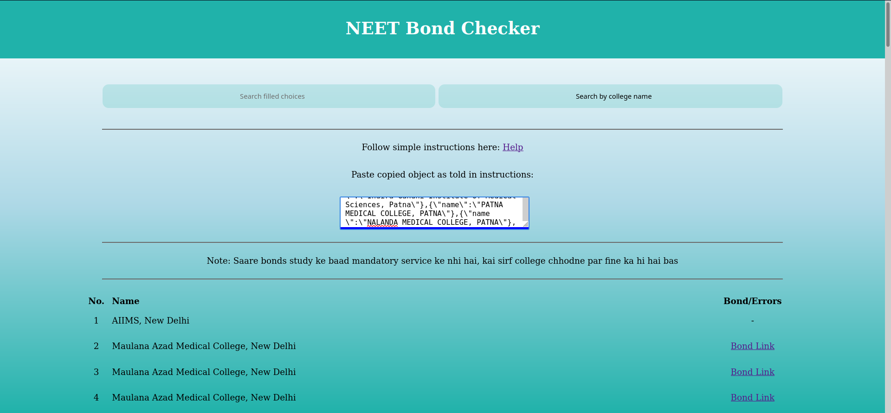

# NEET Bond Checker

 

Checks your choices in MCC NEET counselling choice filling, for bonds.

Many students don't like bonds (ie. mandatory condition to work for the same college as junior doctor after studies for some years)

**आवश्यकता ही आविष्कार की जननी है**

**Aavashyakta hi aawishkar ki jannani hai**

**Need is the mother of inventions**

This is not any invention, but this was made for the sole purpose that my brother needed it.

